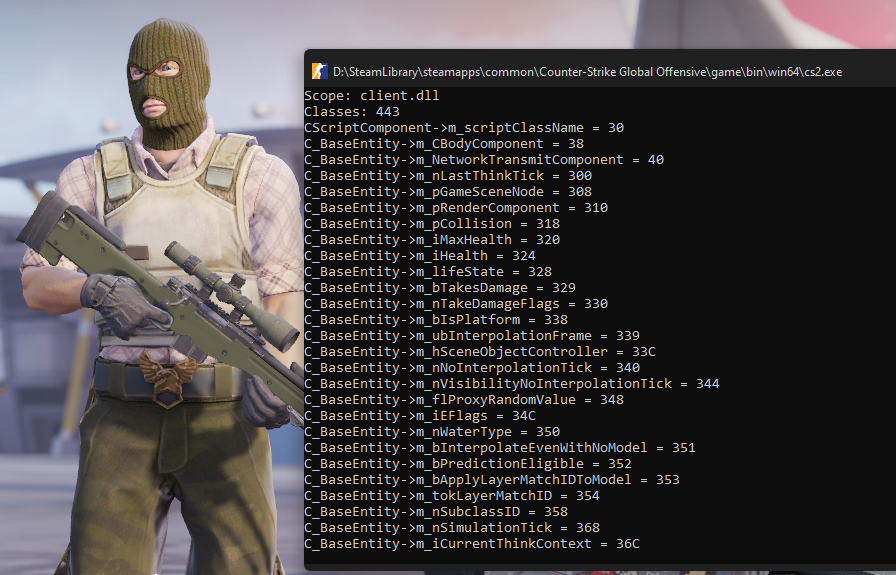

# Source2 Schema Parser
WIP Schema parsing for Source2 Engine games

_Если че у меня фетиш на const_

### Advanced scopes
Define `SCHEMA_CS2` if you need to parse matchmaking.dll scope

### Example
```cpp
#include <SchemaSystem.h>

const SchemaSystem* schemaSystem = SchemaSystem::Create();
const SchemaScope* scope = schemaSystem->Get<Scopes::Client>();
printf("Scope: %s\n", scope->Name());

const CUtlVector<const SchemaClass*> classes = scope->Classes();
printf("Classes: %zu\n", classes.Size);
for (SIZE_T j = 0; j < classes.Size; j++) {
    const SchemaClass* pClass = classes[j];
    PCSTR className = pClass->Name();

    const std::vector<SchemaField> fields = pClass->Fields();
    for (SIZE_T n = 0; n < fields.size(); n++) {
        const SchemaField field = fields[n];
        PCSTR fieldName = field.Name();

        printf("%s->%s = %X\n", className, fieldName, field.Offset());
    }
}
```

### Pictures

